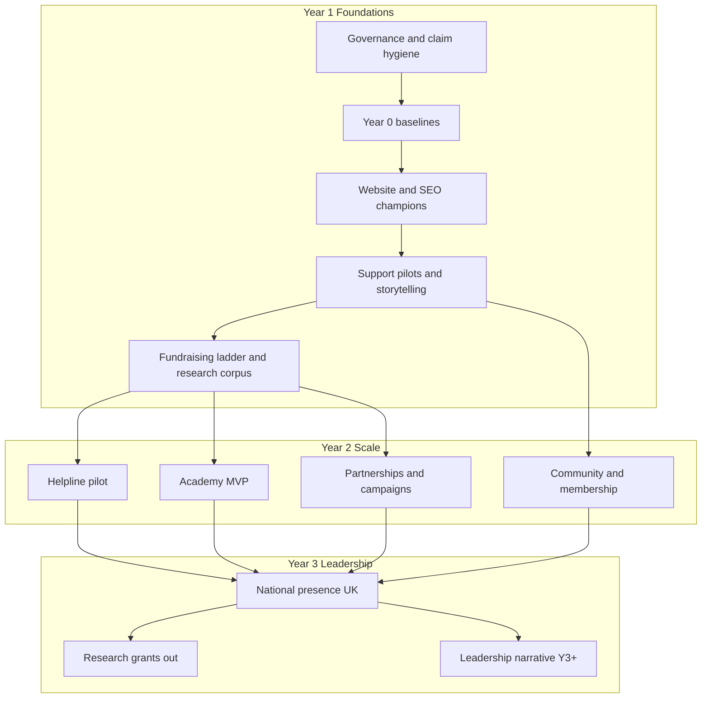
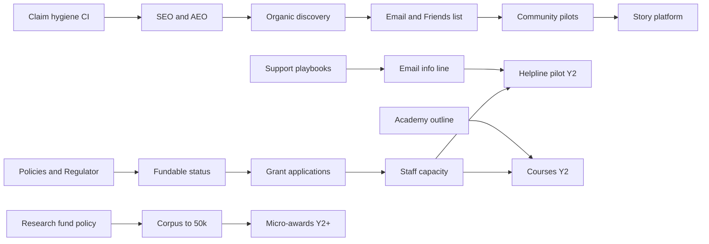

# Living With Arthritis UK — Board Paper
# Three-Year Transformation Strategy (2026–2029)

| Field | Detail |
|---|---|
| **Document type** | Board strategy paper |
| **Organisation** | Living With Arthritis UK (registered charity no. **1218461**, registered 15 June 2026) |
| **Website** | [livingwitharthritis.org.uk](https://livingwitharthritis.org.uk) |
| **Tagline** | Motion is Lotion |
| **Founder / clinical lead** | Louis Maxwell — First Contact Practitioner, HCPC PH128483, Chartered Society of Physiotherapy (CSP) member |
| **Contact** | info@livingwitharthritis.org.uk · 07760 512 084 |
| **Status** | Early-stage UK charity — not a mature national brand |
| **Independence** | Independent of Versus Arthritis, Arthritis UK branding, and Arthritis Foundation (US) |
| **Audience** | Trustees / board; for operational cascade after approval |
| **Date** | September 2026 |
| **Horizon** | Year 1 Foundations (2026/27) → Year 2 Scale (2027/28) → Year 3 Leadership (2028/29) |
| **Classification** | Internal board use; public extracts only after trustee sign-off |

---

## 1. Purpose of this paper

This paper asks the board to approve a credible, patient-centred three-year transformation strategy for Living With Arthritis UK. It translates early digital and clinical strengths into a sequenced programme of **services, fundraising, governance, and advocacy** appropriate to a young registered charity.

It is deliberately ambitious but **not inflated**. Where visitor, member, or helpline baselines are unknown, KPIs are framed as **“baseline TBD — establish Year 0”** with relative ambition targets. It does **not** recommend publishing the Oswestry registered address on the public website. UK regulatory awareness (Charity Commission, Fundraising Regulator, PECR/GDPR, MHRA-safe educational claims) is built into every workstream.

**Ask of the board:** approve the strategic pillars, investment envelopes, Year 1 priorities (P0/P1), and the Top 10 decisions listed in Section 8.

---

## 2. Vision 2029

By end of Year 3 (2029), Living With Arthritis UK is recognised in the UK as a **trusted, clinician-led, digitally excellent patient advocacy charity** for people living with arthritis and related MSK conditions — known for practical self-management (“Motion is Lotion”), transparent governance, and honest educational content that complements (never confuses) NHS pathways and larger peers such as Versus Arthritis.

“Europe leadership” is an **aspirational Year 3+ framing**, not a Year 1 claim. Primary focus remains England/UK nations first.

### Mission

To help people living with arthritis move better, manage pain more confidently, and access clear, evidence-informed support — through education, community, low-impact exercise, peer connection, and responsible advocacy — independent of commercial influence and larger national brands.

### Strategic pillars (2026–2029)

| Pillar | Focus |
|---|---|
| **A. Trust & governance** | Charity Commission compliance, Fundraising Regulator, clinical governance, claim hygiene, privacy |
| **B. Patient value** | Guides, self-management, exercise, peer support, academy, helpline readiness |
| **C. Digital excellence** | Sustainable GitHub-first delivery, SEO/AEO/GEO, accessibility, consent-gated analytics |
| **D. Reach & advocacy** | Awareness, storytelling, national campaigns (UK-first), social, partnerships |
| **E. Sustainable income** | Diversified, ethical fundraising; research fund growth; corporate & grant ladder |

---

## 3. Investment summary (GBP)

Indicative programme envelopes (excludes in-kind volunteer time). Ranges assume phased hiring / contractors; board may stage commitments annually.

| Year | Conservative | Growth | Stretch | Primary use |
|---|---:|---:|---:|---|
| **Y1 Foundations** | £45k–£75k | £80k–£140k | £150k–£220k | Governance, digital hardening, content QA, grant readiness, pilot support/helpline, research fund push |
| **Y2 Scale** | £90k–£150k | £160k–£280k | £300k–£450k | Staffed support, membership/community, campaigns, partnerships, academy MVP |
| **Y3 Leadership** | £150k–£250k | £280k–£450k | £500k–£750k | National presence, commissioned services pathway, research grants out, helpline maturity |
| **3-year total (indicative)** | **£285k–£475k** | **£520k–£870k** | **£950k–£1.42M** | Cumulative programme spend |

**Research fund signal (current):** ~**£5,000** toward a **£50,000** research-fund goal — treat as a real early signal, not a matured research programme.

**Governance note for the board:** All public fundraising must align with Charity Commission guidance and (once registered) Fundraising Regulator standards. Clinical content remains **educational, not diagnostic**. No MHRA-regulated device claims without appropriate pathways. Gift Aid, PECR consent, and DPIAs for new data processing are non-negotiable. Registered address stays off public site strategy; use charity number, email, and phone for public contact.

---

## 4. Current starting point (honest)

| Asset | Status |
|---|---|
| Legal | Registered UK charity **1218461** (15 June 2026) — early-stage |
| Clinical credibility | Founder FCP; HCPC PH128483; CSP membership |
| Digital library | Online library ~**505** blogs + hubs; topic-cluster work underway |
| Digital capability | SEO/AEO/GEO, premium blog UX, consent-gated GA4 (**G-ZLLSD3PXZ9**), chatbot knowledge base, OG fixes, GitHub-first delivery |
| Offerings | Evidence-based guides, self-management, low-impact exercise, peer support intent, helpline intent, community hubs |
| Research | ~£5k raised toward £50k research-fund goal |
| Brand | Distinct from Versus Arthritis / Arthritis Foundation (US); UK peer for capability benchmarks is primarily **Versus Arthritis** |
| Baselines | Traffic, members, helpline volume, conversion: **baseline TBD — establish Year 0** |

Do **not** invent visitor or member counts as current baselines.

---

## 5. Area strategies (1–20)

*Template for each area: Strategic rationale · Expected impact · Resource requirements · Estimated costs · Implementation timeline · KPIs · Risk assessment · Priority.*

---

### 5.1 Website transformation

**Strategic rationale.** The website is the charity’s primary public face and delivery channel. Early-stage charities win trust through clarity, accessibility, claim hygiene, and technical reliability — not vanity metrics. Continue GitHub-first, sustainable static-friendly architecture; deepen topic clusters and premium UX already in flight.

**Expected impact.** Higher trust conversion (donate, subscribe, use tools); better organic discoverability; reduced reputational risk from stale/unverifiable claims; WCAG-aligned experience for people with pain/fatigue.

**Resource requirements.** 0.3–0.6 FTE product/engineering (contractor or volunteer + paid); clinical review time (founder); occasional accessibility audit partner.

**Estimated costs (GBP).**

| Type | Low | Mid | High |
|---|---:|---:|---:|
| One-off (UX/a11y/audit/hardening) | £3k | £8k | £18k |
| Annual (hosting, tooling, maintenance) | £1.2k | £3k | £6k |

**Implementation timeline.** Y1 Q1–Q2: claim source-of-truth, CWV, a11y fixes. Y1 Q3–Q4: hub/tool UX. Y2: personalisation-lite / logged journeys if justified. Y3: continuous improvement vs peer UX standards.

**KPIs.** Core Web Vitals pass rate on champions ≥90%; zero unverifiable public stats; Lighthouse a11y ≥90 on key templates; donate/subscribe conversion vs **baseline TBD — Year 0**; measurement: GSC, consent-gated GA4, automated audits.

**Risk assessment.** Medium likelihood / high impact if claims drift or site downtime — mitigate with content inventory CI, staging, uptime monitoring.

**Priority:** **P0 Critical**

---

### 5.2 Patient support services

**Strategic rationale.** Education alone is not enough; people need pathways into self-management, peer support, and (later) human help. Build services that match capacity — start with structured digital self-help and moderated community before scaled 1:1.

**Expected impact.** Reduced isolation; clearer next steps (NHS/GP/self-care); early brand differentiation as practical and clinician-led.

**Resource requirements.** Y1: founder + 2–5 trained volunteers. Y2: 0.5–1.0 FTE support coordinator. Partners: local MSK/physio networks, social prescribing (exploratory).

**Estimated costs.**

| Type | Low | Mid | High |
|---|---:|---:|---:|
| One-off (playbooks, training) | £1k | £4k | £10k |
| Annual (staff/volunteer ops Y2+) | £15k | £40k | £75k |

**Timeline.** Y1 Q2: service catalogue & safeguarding. Y1 Q4: pilot peer sessions. Y2: coordinator + expanded hubs. Y3: multi-channel support suite.

**KPIs.** Service users assisted (baseline TBD); CSAT ≥4/5; safeguarding incidents logged 100%; referral clarity audits quarterly.

**Risk.** High impact if safeguarding weak — mitigate with policy, DBS where required, escalation paths. Likelihood medium without investment.

**Priority:** **P0 Critical**

---

### 5.3 Digital health tools

**Strategic rationale.** Low-impact exercise, flare planners, and self-check educational tools extend “Motion is Lotion” into daily use — always educational, never diagnostic/device claims without MHRA pathway.

**Expected impact.** Engagement depth; email/CRM capture (PECR-compliant); differentiation vs brochure-site peers.

**Resource requirements.** 0.2–0.5 FTE eng; clinical sign-off; optional university/student design partners.

**Estimated costs.**

| Type | Low | Mid | High |
|---|---:|---:|---:|
| One-off (tool builds) | £2k | £8k | £25k |
| Annual (maintenance) | £0.5k | £2k | £5k |

**Timeline.** Y1: exercise & flare tools polish. Y2: academy-linked trackers (non-diagnostic). Y3: optional NHS-aligned integrations only if commissioned/funded.

**KPIs.** Tool completions vs baseline TBD; return use rate; clinical review coverage 100% of health claims.

**Risk.** Medium/high if tools overclaim — mitigate with legal/clinical review checklist; no “diagnose” language.

**Priority:** **P1 High**

---

### 5.4 Community engagement

**Strategic rationale.** Peer support and community hubs turn content consumers into a movement. Scale only as moderation capacity allows.

**Expected impact.** Retention, storytelling pipeline, volunteer pipeline, local legitimacy.

**Resource requirements.** Community lead 0.2 FTE Y1 → 0.5–1.0 Y2; volunteer moderators; platform (forum/Discord/Facebook Groups — policy-led choice).

**Estimated costs.**

| Type | Low | Mid | High |
|---|---:|---:|---:|
| One-off (setup) | £0.5k | £2k | £6k |
| Annual | £2k | £12k | £35k |

**Timeline.** Y1 Q3 pilot; Y2 regional hubs; Y3 national community calendar.

**KPIs.** Active community members (baseline TBD); moderation SLA; event attendance; safety incidents = 0 serious.

**Risk.** Toxicity / misinformation — moderate likelihood — mitigate with codes of conduct, clinician escalation, clear “not medical advice” framing.

**Priority:** **P1 High**

---

### 5.5 National advocacy campaigns

**Strategic rationale.** Advocacy amplifies patient voice on waiting lists, work, benefits (PIP), and MSK self-management — UK-first; avoid overclaiming national policy influence in Y1.

**Expected impact.** Brand authority; partnership doors; media; alignment with lived experience.

**Resource requirements.** Campaign lead (contractor Y1); patient advisors; policy researcher (part-time Y2).

**Estimated costs.**

| Type | Low | Mid | High |
|---|---:|---:|---:|
| One-off per campaign | £2k | £8k | £25k |
| Annual advocacy programme | £5k | £25k | £60k |

**Timeline.** Y1: one focused UK campaign (e.g. work & arthritis or waiting-list navigation). Y2: 2 campaigns. Y3: sustained advocacy calendar; Europe watch only.

**KPIs.** Reach (earned media), petition/engagement (baseline TBD), policymaker meetings, partner co-signs.

**Risk.** Political impartiality / Charity Commission campaigning rules — mitigate with trustee approval & legal checklist.

**Priority:** **P2 Medium** (Y1 single campaign = P1)

---

### 5.6 Research funding initiatives

**Strategic rationale.** A transparent research fund builds long-term credibility. Current ~£5k / £50k goal is an honest early signal — grow carefully; do not overstate grant-making capacity.

**Expected impact.** Donor motivation; academic partnerships; eventual small grants for patient-relevant MSK research.

**Resource requirements.** Fundraising lead time; scientific advisory (volunteer Y1–Y2); grants admin Y3.

**Estimated costs.**

| Type | Low | Mid | High |
|---|---:|---:|---:|
| One-off (fund branding, governance) | £1k | £3k | £8k |
| Annual (admin; grants paid out separately) | £1k | £5k | £15k |
| **Grant outflows (when ready)** | — | toward £50k+ corpus | board-approved |

**Timeline.** Y1: hit/near £50k corpus goal; publish fund policy. Y2: first micro-grants or co-funded studentships if corpus & governance ready. Y3: annual call.

**KPIs.** Corpus £; % admin vs grant; applications quality; patient involvement in priorities.

**Risk.** Spending before governance — high impact — mitigate with ring-fence & board policy before any award.

**Priority:** **P1 High**

---

### 5.7 Fundraising strategy

**Strategic rationale.** Follow the honest ladder (governance → grants → corporate/tech → scale). Website’s job is not mythical mega-revenue; it is never to lose a checking donor. Align with existing fundraising roadmap: Fundraising Regulator, Gift Aid, impact report, Lottery/trusts.

**Expected impact.** Sustainable income; reduced founder-dependency; funder confidence.

**Resource requirements.** Y1: founder + freelance bid writer (days). Y2: 0.5 FTE fundraising. Partners: Fundraising Regulator; Google Ad Grants; Benevity listing.

**Estimated costs.**

| Type | Low | Mid | High |
|---|---:|---:|---:|
| One-off (Gift Aid, pages, CRM lite) | £1k | £4k | £12k |
| Annual (staff, fees, donor care Y2+) | £10k | £45k | £90k |

**Timeline.** Y1 Q1–Q2 fundable basics; Y1 grants pipeline; Y2 corporate; Y3 major donor/legacy exploration.

**KPIs.** Income by stream; Gift Aid take-up %; cost per £ raised; donor retention (baseline TBD).

**Risk.** Over-reliance on one stream / reputational partner risk — diversify; ABPI-aware pharma rules.

**Priority:** **P0 Critical**

---

### 5.8 Corporate partnerships

**Strategic rationale.** Employers with ageing workforces, insurers, and tech nonprofits can provide cash or in-kind. Prefer workshops and MSK wellbeing value over logo-only deals. Pharma only with strict transparency.

**Expected impact.** Restricted/unrestricted income; reach; in-kind tooling.

**Resource requirements.** Partnerships days Y1; 0.3–0.5 FTE Y2; legal review templates.

**Estimated costs.**

| Type | Low | Mid | High |
|---|---:|---:|---:|
| One-off (packs, due diligence) | £1k | £3k | £8k |
| Annual (BD time) | £5k | £20k | £50k |

**Timeline.** Y1: Ad Grants + 2–3 exploratory CSR. Y2: charity-of-year pitches. Y3: multi-year MoUs.

**KPIs.** Partners signed; £ + in-kind value; brand-safety incidents = 0.

**Risk.** Mission drift — high impact if poorly vetted — board approval matrix for partners >£5k.

**Priority:** **P2 Medium** (Ad Grants / tech in-kind = P1)

---

### 5.9 Volunteer growth

**Strategic rationale.** Volunteers multiply capacity for moderation, peer support, content QA, and events — with proper induction and boundaries.

**Expected impact.** Cost-effective scale; community ownership; future staff pipeline.

**Resource requirements.** Volunteer manager (0.2 FTE Y1 → 0.5 Y2); DBS budget where roles require; training materials.

**Estimated costs.**

| Type | Low | Mid | High |
|---|---:|---:|---:|
| One-off | £0.5k | £2k | £5k |
| Annual | £2k | £10k | £25k |

**Timeline.** Y1 Q2 volunteer framework; Y2 20–50 active volunteers (ambition, not baseline); Y3 specialised roles (research, advocacy).

**KPIs.** Active volunteers; hours; retention 6+ months; training completion %.

**Risk.** Burnout / quality — mitigate role descriptions, hours caps, clinical escalation.

**Priority:** **P1 High**

---

### 5.10 Membership programmes

**Strategic rationale.** Membership can deepen belonging and predictable income — but only after value proposition is clear and ops ready. Avoid premature paid tiers that disappoint.

**Expected impact.** Recurring revenue; advocacy base; research participation pool.

**Resource requirements.** CRM/membership tool; 0.2 FTE ops Y2; content perks.

**Estimated costs.**

| Type | Low | Mid | High |
|---|---:|---:|---:|
| One-off | £1k | £5k | £15k |
| Annual | £2k | £12k | £30k |

**Timeline.** Y1: free “Friends of” list only. Y2: soft launch membership. Y3: tiered benefits if retention strong.

**KPIs.** Members (baseline TBD); churn; NPS; net contribution after cost.

**Risk.** Admin load > income — start free; gate paid on evidence.

**Priority:** **P2 Medium**

---

### 5.11 Content marketing

**Strategic rationale.** ~505 articles are a moat only if quality, UK pathway accuracy, and distribution stay strong. Prefer fewer excellent updates over volume spam. Clinical review for treatment claims.

**Expected impact.** Organic growth; email nurture; media/syndication; academy feedstock.

**Resource requirements.** Content editor 0.3 FTE; Louis clinical review slots; occasional freelance writers.

**Estimated costs.**

| Type | Low | Mid | High |
|---|---:|---:|---:|
| One-off (style guide refresh) | £0.5k | £2k | £5k |
| Annual | £8k | £25k | £60k |

**Timeline.** Ongoing; Y1 champion refresh; Y2 multimedia; Y3 patient academy curricula packages.

**KPIs.** Published/updated champions; email growth (baseline TBD); engagement time; clinical review lag <14 days for priority pages.

**Risk.** Medical inaccuracy — high impact — review workflow mandatory.

**Priority:** **P0 Critical**

---

### 5.12 SEO and organic traffic growth

**Strategic rationale.** Align with `docs/SEO-90-DAY-VISIBILITY-PLAN.md`: topic clusters, trust consistency, internal linking, snippets/AEO, 30 champions, backlinks, no invented metrics. GitHub-only delivery; no Lovable credit spend for edits.

**Expected impact.** Sustainable discovery; branded search clarity vs larger peers; AI-answer readiness without unsafe auto-advice.

**Resource requirements.** SEO engineering in existing delivery model; GSC owner; quarterly link outreach days.

**Estimated costs.**

| Type | Low | Mid | High |
|---|---:|---:|---:|
| One-off (tooling) | £0 | £0.5k | £2k |
| Annual (tools, outreach) | £0.5k | £3k | £12k |

*(Labour mostly covered under website/content.)*

**Timeline.** Y1: 90-day plan + establish Year 0 baselines. Y2: dominate cluster long-tails. Y3: authority content & digital PR.

**KPIs.** Impressions/CTR/position on 30 champions (GSC); indexed coverage; zero fake public traffic claims; branded query disambiguation progress.

**Risk.** Algorithm volatility — diversify channels; measure honestly.

**Priority:** **P0 Critical**

---

### 5.13 AI-powered patient support

**Strategic rationale.** Chatbot knowledge base already started — extend as **retrieval over approved content**, with clear limits, human escalation, and no diagnostic pretence. PECR/GDPR for any logged chats.

**Expected impact.** 24/7 first-line navigation; reduced repetitive founder load; consistent signposting.

**Resource requirements.** 0.1–0.3 FTE eng; content curator; DPIA; optional vendor (prefer self-hosted/RAG over opaque medical bots).

**Estimated costs.**

| Type | Low | Mid | High |
|---|---:|---:|---:|
| One-off | £1k | £5k | £20k |
| Annual | £0.5k | £3k | £12k |

**Timeline.** Y1 Q2–Q3: harden KB + disclaimers + eval set. Y2: triage to human queue. Y3: multilingual UK nations stretch if funded.

**KPIs.** Deflection rate with satisfaction; escalation rate; hallucination incidents (target near-zero on clinical); DPIA complete.

**Risk.** Harmful advice — high impact — mitigate allowlist sources, refusal patterns, human review logs.

**Priority:** **P1 High**

---

### 5.14 Patient education academy

**Strategic rationale.** Structured learning (newly diagnosed, flare management, work & arthritis, exercise progressions) packages the library into outcomes — future commissioned-service evidence.

**Expected impact.** Completions; employer/ICB interest; membership value.

**Resource requirements.** Curriculum designer (contractor); clinical lead; LMS-lite or static course pages first.

**Estimated costs.**

| Type | Low | Mid | High |
|---|---:|---:|---:|
| One-off (MVP courses) | £3k | £12k | £35k |
| Annual | £2k | £10k | £25k |

**Timeline.** Y1 Q4 outline + 1 pilot course. Y2: 4–6 courses. Y3: certificate pathways / CPD partnerships explorative.

**KPIs.** Enrolments/completions (baseline TBD); pre/post confidence scores; employer pilots.

**Risk.** Scope creep — ship MVP static modules first.

**Priority:** **P2 Medium** (pilot = P1 in Y1 Q4)

---

### 5.15 Arthritis helpline

**Strategic rationale.** Helpline intent is central to “support” brand — but premature phone lines without staffing/safeguarding create risk. Sequence: email/callback → scheduled clinics → phone helpline hours.

**Expected impact.** High-trust support; qualitative insight for services; media credibility.

**Resource requirements.** Trained responders; telephony; clinical backup rota; policies. Y2 minimum viable staffing.

**Estimated costs.**

| Type | Low | Mid | High |
|---|---:|---:|---:|
| One-off | £1k | £5k | £15k |
| Annual (Y2+) | £25k | £60k | £120k |

**Timeline.** Y1: email/info line SLA + scripts. Y2 Q1–Q2: limited-hours helpline pilot. Y3: expanded hours if funded.

**KPIs.** Contacts handled; wait/callback time; outcome codes; serious incident rate; user satisfaction.

**Risk.** Clinical/legal exposure — high — mitigate protocols, “not a substitute for emergency/NHS 111/999”, documentation.

**Priority:** **P1 High** (full phone = P2 until funding)

---

### 5.16 National awareness campaigns

**Strategic rationale.** Distinct from advocacy policy work: public awareness of early signs, movement benefits, and independent identity. Time with Arthritis-related awareness moments; avoid confusion with Versus Arthritis campaigns.

**Expected impact.** Brand search lift; social reach; fundraising spikes.

**Resource requirements.** Creative/contractor; always-on organic + selective paid (Ad Grants preferred).

**Estimated costs.**

| Type | Low | Mid | High |
|---|---:|---:|---:|
| One-off per burst | £1k | £6k | £20k |
| Annual | £3k | £15k | £40k |

**Timeline.** Y1: 1–2 bursts. Y2–Y3: calendarised national moments.

**KPIs.** Reach, branded search (GSC), donate spikes, share of voice qualitative vs peers.

**Risk.** Brand confusion with larger charities — always “Living With Arthritis UK / charity 1218461 / independent”.

**Priority:** **P2 Medium**

---

### 5.17 Social media strategy

**Strategic rationale.** Social amplifies “Motion is Lotion” with short exercise, myth-busting, and stories — PECR-aware CTAs into owned channels.

**Expected impact.** Community growth; traffic assists; volunteer/story recruitment.

**Resource requirements.** 0.2 FTE social Y1; design templates; community listening.

**Estimated costs.**

| Type | Low | Mid | High |
|---|---:|---:|---:|
| One-off | £0.5k | £2k | £5k |
| Annual | £2k | £10k | £30k |

**Timeline.** Y1: 3–5 posts/week consistency + link hygiene. Y2: short video. Y3: creator partnerships carefully vetted.

**KPIs.** Engagement rate; referral sessions (GA4); follower growth vs baseline TBD; response SLA.

**Risk.** Misinformation comments — moderate — moderate promptly; pin disclaimers.

**Priority:** **P1 High**

---

### 5.18 Patient storytelling platform

**Strategic rationale.** Lived experience builds empathy and advocacy evidence — with consent, editing standards, and safeguarding (especially for identifiable health data).

**Expected impact.** Media assets; donor conversion; research priority setting; SEO “people also ask” depth.

**Resource requirements.** Editor; consent forms; optional multimedia.

**Estimated costs.**

| Type | Low | Mid | High |
|---|---:|---:|---:|
| One-off | £0.5k | £2k | £6k |
| Annual | £1k | £6k | £18k |

**Timeline.** Y1 Q3: story guidelines + 6–12 published stories. Y2: video/audio. Y3: annual anthology / campaign series.

**KPIs.** Stories published with valid consent; reuse in campaigns; qualitative impact for funders.

**Risk.** Re-identification / distress — high impact — mitigate consent, anonymisation options, right to withdraw.

**Priority:** **P1 High**

---

### 5.19 Revenue diversification

**Strategic rationale.** No single stream should dominate. Blend: individual giving + Gift Aid, grants, corporate, Ad Grants, optional membership, commissioned workshops, research co-funding. Avoid dependency on speculative digital ads spend.

**Expected impact.** Resilience; board confidence; multi-year planning ability.

**Resource requirements.** Shared with fundraising/partnerships; finance volunteer/treasurer discipline.

**Estimated costs.** Covered mainly in 5.7–5.8; allocate **£2k–£8k** annual for payment rails, CRM, audit readiness.

**Timeline.** Y1: 2–3 streams live. Y2: 4+. Y3: reserves policy funded.

**KPIs.** % income by stream (none >60% by Y3 ideal); reserves months; unrestricted ratio.

**Risk.** Restricted-fund lockup — track designations carefully.

**Priority:** **P0 Critical**

---

### 5.20 Governance and credibility enhancements

**Strategic rationale.** Funders and the public check the Charity Commission first. Complete Trust & Governance transparency, Fundraising Regulator registration, policies (safeguarding, complaints, conflicts, data protection), clinical governance for content, and honest impact reporting — without fake stats.

**Expected impact.** Grant eligibility; reputational moat; board effectiveness.

**Resource requirements.** Trustees’ time; clerk/secretary support; external advice as needed (charity law/DP).

**Estimated costs.**

| Type | Low | Mid | High |
|---|---:|---:|---:|
| One-off (policies, legal review) | £1k | £4k | £12k |
| Annual (Regulator fees, insurance, filing) | £1k | £4k | £10k |

**Timeline.** Y1 Q1–Q2: fundable basics complete. Ongoing annual filings. Y2: expanded advisory panel. Y3: external evaluation of a flagship programme.

**KPIs.** On-time Commission filings; Fundraising Regulator badge; policy review cycle ≤12 months; trustee attendance; zero unverifiable public claims.

**Risk.** Compliance failure — high impact — calendarised compliance owner.

**Priority:** **P0 Critical**

---

## 6. Phased roadmap

### Year 1 — Foundations (2026/27)

- Lock governance, claim hygiene, Gift Aid, Fundraising Regulator pathway.
- Establish **Year 0 measurement baselines** (GSC, GA4 consent cohort, email, support contacts).
- Execute SEO 90-day visibility themes; harden website & chatbot KB.
- Pilot peer support; email/info-line SLA; storytelling consent framework.
- Grow research fund toward £50k; first credible impact report (qualitative + verified counts only).
- One focused UK awareness/advocacy burst — not Europe claims.

### Year 2 — Scale (2027/28)

- Hire/contract support & fundraising capacity as income allows.
- Helpline limited-hours pilot; academy MVP courses; membership soft launch.
- Corporate partnerships beyond in-kind; 2 advocacy/awareness moments.
- Community hubs expansion with moderation capacity.
- First research micro-awards **only if** fund policy & corpus ready.

### Year 3 — Leadership (2028/29)

- Recognised UK clinician-led digital arthritis advocacy voice (honest niche leadership — not claiming Versus Arthritis scale).
- Mature helpline/support suite if funded; national campaign calendar.
- Commissioned/ICB exploratory pathways; stronger research call.
- Aspirational Europe thought-leadership framing **only if** UK base solid.

---

## 7. Consolidated budget envelope

| Scenario | 3-year programme | Assumptions |
|---|---:|---|
| **Conservative** | £285k–£475k | Lean contractors, heavy volunteer, grants-led |
| **Growth** | £520k–£870k | Part-time staff Y2, helpline pilot, academy, campaigns |
| **Stretch** | £950k–£1.42M | Full support staffing, national campaigns, larger grant-making |

Board should approve **Year 1 envelope** first; release Y2/Y3 subject to income and KPI review. Prefer sustainable digital (GitHub/static where relevant); **no Lovable credit spend** recommendations.

---

## 8. Top 10 board decisions needed

1. Approve this three-year strategy and pillar set (A–E).  
2. Approve Year 1 investment envelope (conservative vs growth).  
3. Appoint compliance owner for Charity Commission + Fundraising Regulator pathway.  
4. Approve public claims policy (no unverifiable stats; content inventory as source of truth).  
5. Approve research fund policy (ring-fence, award criteria, no awards before policy).  
6. Approve partner due-diligence matrix (especially pharma/health-tech).  
7. Approve sequencing: email/info support before full phone helpline.  
8. Approve safeguarding & volunteer framework before community scale-up.  
9. Approve clinical governance for content/AI (educational boundaries; HCPC-led review).  
10. Approve Year 0 baseline measurement plan (GA4 consent, GSC, CRM) and quarterly board KPI pack.

---

## 9. Dependencies and sequencing

Critical path: **governance/claims → fundable → income → staffed support/helpline**. Digital SEO can run in parallel but must not outpace claim hygiene.

---

## 10. Risk register (top 10 organisational risks)

| # | Risk | L | I | Mitigation |
|---|---|---|---|---|
| 1 | Unverifiable public claims / trust breach | M | H | Content inventory; board claims policy; SEO plan Priority 0 |
| 2 | Safeguarding failure in community/helpline | M | H | Policies, training, escalation, phased launch |
| 3 | Clinical overclaim / MHRA/regulatory issue | L | H | Educational-only standards; clinical review |
| 4 | Founder dependency / key-person risk | H | H | Document processes; hire/contract; trustee succession |
| 5 | Funding shortfall vs growth plan | H | H | Conservative envelope default; stage gates |
| 6 | Brand confusion with Versus Arthritis | M | M | Clear independence messaging; charity number; disambiguation |
| 7 | GDPR/PECR breach (analytics, email, AI logs) | M | H | Consent-gated GA4; DPIAs; PECR-compliant CRM |
| 8 | AI chatbot harmful output | M | H | Approved KB only; eval harness; human escalation |
| 9 | Volunteer/moderation overload | M | M | Caps; pause growth if SLA slips |
| 10 | Research awards before governance ready | L | H | Board policy gate; ring-fenced corpus |

*(L = likelihood, I = impact; H/M/L.)*

---

## 11. Success definition: “UK leading patient advocacy arthritis charity”

**By 2029, success means** Living With Arthritis UK is among the UK’s most **trusted clinician-led digital destinations** for practical arthritis self-management and patient voice — measured by:

- Verified governance & Fundraising Regulator alignment  
- High-quality educational reach (organic + owned) with **honest metrics**  
- Operating support pathways (community + info/helpline appropriate to funding)  
- Research fund actively governed (corpus progressed from ~£5k signal; awards only when ready)  
- Distinct independent identity respected by users and partners  

### Honest caveats vs Versus Arthritis

Versus Arthritis is a **mature national brand** with decades of history and fundraising at a scale (multi-tens of millions annually) that a charity registered in 2026 will not match in three years. Leadership here means **excellence in a defined niche** (digital self-management, FCP-led education, “Motion is Lotion”, transparent early-stage advocacy) — **not** matching Versus Arthritis’ total income, helpline volume, or brand awareness. Arthritis Foundation (US) is a **benchmark for standards/capabilities only**, not a UK peer or branding template. Europe-wide leadership remains **aspirational post-2029** unless UK foundations are unequivocally solid.

---

## 12. Appendix — Alignment with `docs/SEO-90-DAY-VISIBILITY-PLAN.md`

This strategy **extends** and does **not contradict** the 90-day visibility plan:

| SEO plan theme | Board strategy alignment |
|---|---|
| Source of truth / kill fake stats | Pillar A; Area 5.1 & 5.20; Decision #4 |
| Eight topic clusters | Area 5.11–5.12; Y1 Foundations |
| Internal linking system | Website transformation Y1 |
| Featured snippets & AI answers | SEO + AI support; clinical review required |
| Thirty SEO Champions | 80% SEO engineering focus Y1 |
| Backlinks / digital PR | Content + awareness; no fake authority claims |
| GitHub-only edits; no Lovable credits | Investment principles throughout |
| Charity 1218461; HCPC PH128483; independence | Title facts; brand risk mitigations |
| Oswestry address off site | Explicitly retained as constraint |
| Consent-gated GA4 G-ZLLSD3PXZ9 | Year 0 baselines; privacy risk mitigations |
| ~505 blogs as inventory | Content marketing starting asset |

**Measurement discipline:** Where the growth-executive summary elsewhere in the repo uses stretch traffic ambitions, **this board paper prevails for trustee reporting**: establish Year 0 baselines first; report relative growth and champion ranking progress; never publish invented people-supported or engagement rates.

---

## 13. Priority heatmap (summary)

| Priority | Areas |
|---|---|
| **P0 Critical** | Website; Patient support services; Fundraising; Content marketing; SEO; Revenue diversification; Governance |
| **P1 High** | Digital tools; Community; Research fund; Volunteers; AI support; Helpline (phased); Social; Storytelling; (Y1 single advocacy/awareness) |
| **P2 Medium** | National advocacy (full); Corporate (beyond in-kind); Membership; Academy (post-pilot); National awareness calendar; full phone helpline until funded |
| **P3 Later** | Europe leadership framing; large-scale commissioned services; heavy paid media beyond Ad Grants |

---

## 14. Board resolution (draft)

*The Board approves the Three-Year Transformation Strategy (2026–2029) as the guiding framework for Living With Arthritis UK, authorises the Year 1 Foundations envelope within the Conservative/Growth range selected at the meeting, and instructs the executive to return quarterly KPI packs using Year 0 baselines and the Top 10 decisions log.*

---

**Document control**

| Version | Date | Author | Notes |
|---|---|---|---|
| 1.0 | Sep 2026 | Prepared for Louis Maxwell / Board | Initial board-ready strategy |

*— End of board paper —*
