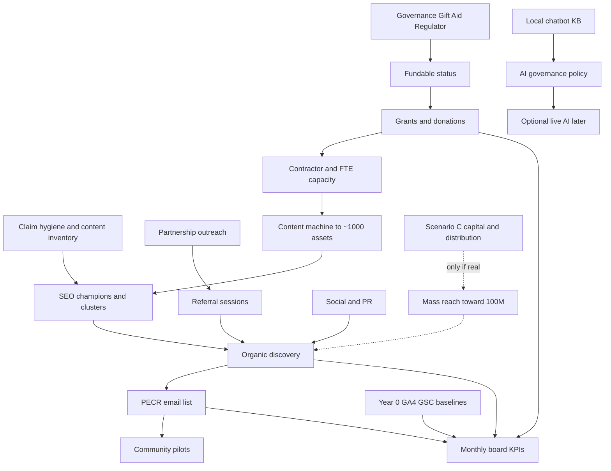

# Living With Arthritis UK — CEO Paper
# 10-Month Growth & Execution Strategy (Sep 2026 – Jul 2027)

| Field | Detail |
|---|---|
| **Document type** | Board / CEO execution strategy |
| **Organisation** | Living With Arthritis UK (registered charity no. **1218461**, registered 15 June 2026) |
| **Website** | [livingwitharthritis.org.uk](https://livingwitharthritis.org.uk) |
| **Tagline** | Motion is Lotion |
| **Founder / clinical lead** | Louis Maxwell — FCP, HCPC PH128483, CSP member |
| **Contact** | info@livingwitharthritis.org.uk · 07760 512 084 |
| **Status** | Early-stage UK charity — not a mature national brand |
| **Independence** | Independent of Versus Arthritis / Arthritis UK branding and Arthritis Foundation (US) |
| **Audience** | Trustees, CEO/founder, operational leads |
| **Horizon** | **10 months** from board approval (Month 1 ≈ Sep/Oct 2026 → Month 10 ≈ Jun/Jul 2027) |
| **Aligns with** | `BOARD-3-YEAR-TRANSFORMATION-STRATEGY.md`, `SEO-90-DAY-VISIBILITY-PLAN.md`, `SEO-UK-SEARCH-RESEARCH.md` |
| **Classification** | Internal board use; public extracts only after trustee sign-off |
| **Digital principle** | GitHub-first delivery; **no Lovable credit spend** |
| **Privacy / claims** | UK PECR/GDPR; Charity Commission; Fundraising Regulator pathway; educational not diagnostic |
| **Address policy** | Do **not** publish Oswestry registered address on the public site |

---

## 0. Executive brief for the board

### Purpose

This paper converts the three-year transformation strategy into a **board-executable 10-month operating plan**: traffic growth, content/SEO machine, brand authority, social, communities, partnerships, fundraising, UX, AI, monthly KPIs, and sequenced must-do lists.

It is **ambitious and measurable**, patient-centred, and UK-aware. It does **not** invent visitor or member baselines. Where numbers are unknown: **"Year 0 baseline TBD from GA4/GSC"** (consent-gated GA4 property **G-ZLLSD3PXZ9**).

### Critical honesty: the 100 million visitor ask

**Plain statement:** Achieving **100 million website sessions in 10 months** for a UK charity registered in June 2026 is an **extreme moonshot**. It is not a realistic organic SEO target. Reaching that order of magnitude would require one or more of:

- Viral / national media moments at BBC/ITV/major newspaper scale, sustained and repeated
- NHS-app or NHS.uk–scale referral / syndication distribution
- Paid amplification budgets typically measured in **£millions**, not tens of thousands
- Platform-level distribution deals (major publishers, app stores, employer networks) far beyond early-stage charity norms

For context: mature UK peer Arthritis UK (`arthritis-uk.org`) has been publicly estimated in the low–mid hundreds of thousands of monthly visits (Semrush public overview order-of-magnitude). NHS.uk condition pages operate at national infrastructure scale. A young charity with ~505 educational pages starts from a different base.

**Therefore this paper:**

1. Treats **100M sessions / 10 months** as **Scenario C — Moonshot stretch** (P0 stretch actions clearly labelled).
2. Delivers a full executable strategy the board can run under **Scenario A (realistic)** or **Scenario B (aggressive)**.
3. Never pretends Scenario C is likely without the budget, partnerships, and distribution inputs listed in Section 1.3.

### Recommendation in one sentence

**Approve Scenario B as the working plan, fund Scenario A as the floor, and treat Scenario C actions as optional stretch only if extraordinary distribution or paid capacity appears.**

---

## 1. Traffic growth strategy

### 1.1 Starting point (honest)

| Asset | Status |
|---|---|
| Content library | ~**505** blogs + hubs; topic clusters underway; recent premium blog UX |
| Tools | Enhanced symptom checker (educational); local chatbot (canned KB — not live LLM) |
| Analytics | Consent-gated GA4 **G-ZLLSD3PXZ9**; GSC (establish Year 0) |
| Traffic baseline | **Year 0 baseline TBD from GA4/GSC** — do not invent sessions |
| Brand | Clinician-led, “Motion is Lotion”, independent of Versus Arthritis |

### 1.2 Channel mix (all scenarios)

| Channel | Role | P0 foundation vs P0 stretch |
|---|---|---|
| **Organic SEO** | Primary durable engine | Foundation |
| **Email / owned** | Retention + conversion | Foundation |
| **Social (FB/IG/LI/TikTok/YT)** | Discovery + community | Foundation; paid boost = stretch |
| **Community partnerships** | Referral + trust | Foundation |
| **PR / digital PR** | Authority + spikes | Foundation (earned); paid wire = stretch |
| **Referral (NHS/HCP/pharmacies)** | High-trust sessions | Foundation pilots; NHS-scale = stretch |
| **Influencers / podcasts** | Reach + brand | Selective foundation; mega-influencer = stretch |
| **YouTube / podcast owned** | Long-form habit | Foundation |
| **Local outreach** | Geo need (NE, deprived areas) | Foundation |
| **Paid search / social / programmatic** | Amplification | Stretch (except Google Ad Grants if approved) |
| **Syndication / NHS distribution** | Mass reach | Moonshot (Scenario C) |

### 1.3 Three scenarios — cumulative sessions (illustrative planning envelopes)

**Important:** Absolute monthly figures below are **planning envelopes for board modelling**, not claimed current traffic. Replace Month 1 “start” with **Year 0 baseline TBD** once GA4/GSC export is locked. Growth rates assume compounding discovery after claim-hygiene + champion SEO + distribution.

#### Scenario A — Disciplined organic + community (realistic)

Assumptions: GitHub-first SEO; 30 champions perfected; email list; modest social; 5–15 partnerships; Google Ad Grants if eligible; **no** large paid media; volunteer-heavy.

| Month | New sessions (approx.) | Cumulative sessions |
|---:|---:|---:|
| M1 | Baseline month (TBD) + early lift | **B₁** |
| M2 | +15–25% MoM on organic cohort | ~1.2× B₁ |
| M3 | Cluster/internal-link effects | ~1.5× B₁ |
| M4 | PR + partner referrals start | ~2.0× B₁ |
| M5 | Content cadence steady | ~2.6× B₁ |
| M6 | Mid-campaign + email loops | ~3.4× B₁ |
| M7 | Seasonal MSK interest | ~4.2× B₁ |
| M8 | Partner embeds / posters | ~5.2× B₁ |
| M9 | Compound organic | ~6.5× B₁ |
| M10 | Year-end push | **~8–12× B₁** cumulative path |

**Honest 10-month outcome (A):** Meaningful multi-fold growth from Year 0; **not** millions of monthly sessions unless B₁ is already large. Typical early-stage charity organic path: thousands → low tens of thousands monthly sessions if execution is excellent — still far from 100M cumulative.

#### Scenario B — Aggressive growth (grants + partnerships + content machine)

Assumptions: Scenario A **plus** funded content ops (refresh 505 + ~500 new), grant-funded outreach, 30–80 active partners, Google Ad Grants maxed, selective paid social tests (£2–8k/mo when income allows), podcast/YT cadence, HCP referral packs, 2–3 earned media hits.

| Month | Planning cumulative vs B₁ | Notes |
|---:|---|---|
| M1–M2 | 1.0–1.4× | Foundations + Ad Grants live |
| M3–M4 | 2–4× | Champions + partner wave 1 |
| M5–M6 | 5–10× | Content machine + PR |
| M7–M8 | 12–25× | Regional + HCP + viral posts |
| M9–M10 | **30–80× B₁** path | Still depends on B₁; could reach **high tens of thousands to low hundreds of thousands** monthly sessions in a strong B case — **not** 10M+/mo |

**Honest 10-month outcome (B):** Best credible stretch for a young UK charity with disciplined spend: material national digital presence in niche MSK self-management; cumulative sessions possibly in the **hundreds of thousands to low millions** over 10 months **if** B₁ and virality cooperate — still **~2 orders of magnitude below 100M**.

#### Scenario C — Moonshot path toward 100M (what would have to be true)

| Requirement | Indicative scale | Likelihood without new capital |
|---|---|---|
| Paid + distribution budget | **£2M–£15M+** media/syndication over 10 months | Very low for early-stage charity |
| NHS / national health app placement | App library feature or NHS.uk deep partnership | Very low in Year 0–1 |
| Viral moments | Multiple national TV/news spikes driving tens of millions each | Low; not controllable |
| Publisher syndication | Major UK publishers mirror content at scale | Low without commercial deals |
| Platform algorithms | TikTok/YT/IG repeatedly push to UK+global mass | Unpredictable |
| Session quality | Even if achieved, PECR/GDPR, server cost, moderation, clinical risk explode | High operational risk |

**Illustrative cumulative path only if extraordinary inputs land:**

| Month | Cumulative sessions (moonshot model) | What must fire |
|---:|---:|---|
| M1–M2 | 0.5M–2M | Paid launch + major PR |
| M3–M4 | 5M–15M | NHS/partner syndication |
| M5–M6 | 20M–40M | Sustained viral + paid |
| M7–M8 | 45M–70M | Multi-platform saturation |
| M9–M10 | **→ 100M** | Continuous national distribution |

**Board stance:** Scenario C actions are labelled **P0 stretch**. Do **not** set staff bonuses or public promises against 100M. Celebrate B outcomes as success.

### 1.4 Channel playbooks (foundation)

**Organic SEO** — Execute `SEO-90-DAY-VISIBILITY-PLAN` inside Months 1–3; extend champions and clusters through Month 10 (Section 3).

**Social** — Daily useful micro-content; weekly carousels; bi-weekly short video; LinkedIn for HCP/trust; TikTok for myth-busting “Motion is Lotion” (Section 5).

**Community partnerships** — Waiting-room poster packs, social prescribing link-outs, physio clinic resource lists (Section 7).

**PR** — Earned first: founder FCP angle, research fund story (£5k→£50k), patient-centred “honest charity” narrative (Section brand + Top 20 PR).

**Referral** — UTM-tagged partner landing pages; HCP PDF one-pagers; pharmacy shelf cards (no Oswestry address).

**Email** — PECR double-consent; welcome series; flare-season nurture; donate/research fund asks.

**Influencers / podcasts** — Micro UK MSK/physio creators first; guest on physio/rheum podcasts; avoid paid mega-influencer until ROI proven.

**YouTube** — 8–12 min educational series + Shorts cutdowns; clinical review on all treatment claims.

**Local outreach** — Prioritise North East and deprived localities (prevalence signal from `SEO-UK-SEARCH-RESEARCH`) alongside London absolute-volume content.

**NHS/HCP engagement** — First Contact Physio networks, CSP channels, ICB MSK leads — educational resource offers, not diagnostic tools.

---

## 2. Content strategy (millions-visitor capable architecture)

### 2.1 Principle

A **millions-visitor-capable** content system is not “publish more random posts.” It is:

1. **Pillars** that own head terms (pain, OA, exercises, diet, symptoms, treatments, flares, PIP/benefits)
2. **Clusters** that capture long-tail + AI-answer demand
3. **Refresh** of the existing ~505 assets (often higher ROI than net-new)
4. **Tools** that convert (checker, exercises, chatbot → email)
5. **Claim hygiene** so YMYL trust compounds

### 2.2 Eight clusters (aligned with SEO-90-day plan)

| # | Cluster | Pillar focus | 10-month content push |
|---|---|---|---|
| 1 | Arthritis Pain | Pain relief / managing pain UK | Heat/cold, pacing, TENS, NSAID education, flare-pain |
| 2 | Osteoarthritis | OA condition + joint hubs | Knee/hip/hand/spine OA daily living |
| 3 | Exercises | Exercise hub + joint programmes | Chair, aquatic, strength, tai chi, flare-safe |
| 4 | Diet | Diet hub | Mediterranean, weight, myths, supplements caution |
| 5 | Symptoms | Symptoms / newly diagnosed | Early signs, stiffness, red flags → NHS |
| 6 | Treatments | Medicines / physio / surgery education | Steroids, DMARDs overview, injections, replacement prep |
| 7 | Flare-Ups | Flare hub | Action plans, boom-bust, work flares |
| 8 | Benefits & PIP | PIP / disability support | PIP evidence, Access to Work, fit notes |

### 2.3 1,000-article roadmap (505 existing + refresh/new → ~1,000 managed assets)

**Definition:** “1,000-article roadmap” = inventory of **~1,000 high-quality educational URLs** by Month 10, composed of:

| Bucket | Count target | Notes |
|---|---:|---|
| Existing blogs/hubs | ~505 | Keep; prioritise refresh |
| Deep refresh / upgrade (champions + thin pages) | 150–250 of the 505 | Title, FAQ, schema, links, clinical review box |
| Net-new supporting articles | 350–450 | Fill cluster gaps; UK English; NHS pathway language |
| New/expanded pillars & tool landing pages | 20–40 | Count toward managed inventory |
| **Managed educational inventory by M10** | **≈ 1,000** | Quality > vanity publish rate |

### 2.4 Phased publish/refresh cadence

| Phase | Months | Must deliver | Cadence |
|---|---|---|---|
| **Foundation** | M1–M2 | Claim source-of-truth; 30 champions v1; cluster map live | 8–12 upgrades/mo + 4–6 new |
| **Machine** | M3–M5 | 4 pillars gold-standard; 100 FAQ-ready pages | 12–20 new/mo + 10 refreshes |
| **Scale** | M6–M8 | All 8 clusters dense; regional/access pages | 15–25 new/mo + continuous refresh |
| **Compound** | M9–M10 | Snippet harvest; seasonal packs; partner co-branded PDFs | 10–15 new/mo + optimisation |

**Clinical gate:** All treatment, medicine, and red-flag content requires HCPC-led review. Educational framing only — never diagnostic.

### 2.5 High-volume topic families (examples)

Pain day-to-day; knee/hip/hand OA living; flare action plans; MSK self-referral by nation/ICB pattern; PIP evidence letters; fatigue & sleep; work & arthritis; mental health comorbidity (signpost); swimming/walking programmes; winter stiffness; post-injection care education; waiting-list survival guides.

---

## 3. SEO strategy

### 3.1 Audit (Month 1)

| Workstream | Action |
|---|---|
| Technical | CWV on champions; crawl errors; sitemap indexation (GSC); canonical hygiene |
| Content | Inventory CI (`contentInventory`); kill unverifiable stats |
| IA | `topicClusters.ts` complete; pillar ↔ spoke links |
| E-E-A-T | Author/reviewer bios; review dates; references; charity number visible |
| Schema | Article, FAQ, HowTo, Organization, BreadcrumbList; speakable where safe |
| AEO / AI search | Direct-answer intros; citeable paragraphs; avoid hallucinated stats |
| Voice | Speakable FAQ for top 50 questions |
| Links | Authority outreach sheet; quarterly linkable asset |

### 3.2 Technical priorities

- GitHub-first static-friendly performance; no Lovable credit dependency
- Consent-gated analytics only
- Internal link vitest: every slug → cluster + existing pillar
- Image a11y + OG consistency (existing guardrails)

### 3.3 Internal links & clusters

Ship product rules from SEO-90-day plan: blog template always shows parent pillar, 2–4 siblings, one tool CTA, one NHS/next-step CTA.

### 3.4 E-E-A-T

| Signal | Implementation |
|---|---|
| Experience | Lived-experience stories with consent; no fake counts |
| Expertise | Louis Maxwell FCP credentials; guest HCP contributors |
| Authoritativeness | Citations to NICE/NHS/peer-reviewed; independence statement |
| Trust | Charity 1218461; Fundraising Regulator pathway; clear medical disclaimer |

### 3.5 Snippets, AEO, voice

For 100–200 high-value questions: definition → steps → when to seek NHS help. Align with AI-answer formats without inventing clinical novelty.

### 3.6 Link acquisition (ethical)

No PBNs. Quarterly linkable assets (PIP checklist PDF, flare plan, MSK self-referral explainer). University, physio clinic, LA, and charity resource-page outreach.

---

## 4. Brand authority

### 4.1 Positioning

**UK clinician-led educational charity for everyday life with arthritis** — practical self-management (“Motion is Lotion”), transparent early-stage governance, complementary to NHS and larger peers — **not** claiming Versus Arthritis scale.

### 4.2 Citation strategy

- Cite NICE, NHS.uk, OHID/Fingertips, peer-reviewed rheumatology where claims need evidence
- Maintain public “About our evidence” / review policy
- Encourage partners to cite LWA resources (poster packs, PDFs)

### 4.3 HCP trust

- CSP / FCP narrative; clinic resource packs
- Clear “educational, not a medical device / not diagnostic”
- Advisory input from rheumatology, OT, pharmacy (volunteer/advisory)

### 4.4 Expert contributors & advisory board / ambassadors

| Role | Target by M10 |
|---|---|
| Clinical advisory (volunteer) | 3–7 named advisors (rheum/physio/OT/pharmacy) |
| Patient ambassadors | 8–20 consented storytellers / local leads |
| Expert guest articles | 12–24 reviewed pieces |
| Academic links | 2–5 uni student/project collaborations |

---

## 5. Social expansion

| Platform | Cadence (foundation) | Content forms | Stretch |
|---|---|---|---|
| **Facebook** | 4–6 posts/wk | Groups-friendly tips, events, peer prompts | Boosted posts |
| **Instagram** | 5–7/wk | Carousels, Reels, infographics | Partnership takeovers |
| **LinkedIn** | 3–5/wk | HCP, trustees, grants, FCP insights | Thought-leadership ads |
| **TikTok** | 3–5/wk | Myth-busts, 30–60s movement tips | Creator funds / paid |
| **YouTube** | 2–4 long + weekly Shorts | Series + clips | Ad Grants / promote |
| **Community** | Ongoing | Moderated groups / Discord-or-FB policy choice | Paid community manager |

**Viral mechanics (ethical):** Relatable flare humour + clear NHS next step; before/after mobility stories with consent; “one tip” carousels; never sensationalise cures.

**Measurement:** Followers, reach, saves, link CTR, email signups from social UTMs — baselines TBD.

---

## 6. Communities

### 6.1 Nationwide model

| Layer | Months | Capacity gate |
|---|---|---|
| Digital peer spaces | M2–M4 pilot | Moderation SLA + safeguarding |
| Local volunteer hubs | M5–M8 | DBS/training where required |
| Ambassador network | M4–M10 | Story consent + brand training |
| Patient advocates | M6–M10 | Policy advocacy light-touch UK-first |

### 6.2 Support groups & volunteers

- Code of conduct; “not medical advice”
- Volunteer roles: moderators, poster distributors, event helpers, content reviewers (non-clinical)
- Pause growth if moderation SLA slips (aligns with 3-year board risk posture)

---

## 7. Partnerships

### 7.1 Priority partner types

NHS MSK / FCP services · GP practices · physiotherapy clinics · OT services · universities (allied health) · corporates (workforce MSK) · local authorities / public health · community centres · pharmacies · care homes · Active Partnerships / Sport England network · social prescribing link workers.

### 7.2 Offer (what we give)

Free educational packs, waiting-room posters (UTM’d), webinars, student placements, co-branded flare plans — always independence-preserving; pharma only via strict due diligence (ABPI-aware transparency).

### 7.3 Funnel metrics

Partners contacted → MoU/light agreement → asset live → referred sessions (UTM) → email/donate conversion.

---

## 8. Fundraising

Align with `FUNDRAISING-ROADMAP.md` and board Year 1 envelopes.

| Stream | M1–M4 | M5–M10 | Notes |
|---|---|---|---|
| Governance readiness | Fundraising Regulator pathway; Gift Aid; Trust page | Maintain | P0 |
| Grants | Awards for All; trusts; Sport England/Active Partnerships | Larger trusts; LA/ICB exploratory | Realistic £20k–£150k/yr band over time |
| Donations | Frictionless donate + research fund (£5k→£50k) | Monthly giving | Honest impact only |
| Sponsorship | In-kind tech first | Cash CSR workshops | Due diligence |
| Events | 1–2 small community events | Peer walks / Motion is Lotion day | Safeguarding |
| Membership | Soft “Friends of LWA” email tier | Paid membership only if value clear | Don’t rush |
| Crowdfunding | Research fund campaigns | Targeted bursts | Platform fees |
| Legacy | Soft info page | Cultivation Y2+ | Long cycle |

**Google Ad Grants:** Apply early if eligibility met — material Scenario B lever without cash media.

---

## 9. UX (build on recent blog / checker / chatbot work)

### 9.1 Redesign recommendations

| Area | Recommendation | Priority |
|---|---|---|
| Blog templates | Premium reading UX already in flight — standardise TOC, trust box, related cluster, CTAs | P0 |
| Symptom checker | Keep educational framing; journey into email + relevant hub | P0 |
| Chatbot | Local KB now; roadmap to governed live AI later (Section 10) | P0/P1 |
| Donate / Gift Aid | Friction audit; mobile-first | P0 |
| Accessibility | WCAG-oriented; fatigue/pain-friendly (large tap targets, reduced motion option) | P0 |
| Navigation | Cluster-first IA; “I need help with…” intent entry | P1 |
| Personalisation-lite | “Newly diagnosed / flare / PIP / exercise” pathways | P1 |

### 9.2 CRO

Primary conversions: email consent, tool completion, donate, partner resource download, volunteer interest. A/B only with enough traffic; until then, heuristic CRO + session replay ethics policy.

### 9.3 Journeys & retention

Welcome → flare season → exercise streak emails; return-to-tool prompts; community invite after 2nd visit equivalent (privacy-safe).

---

## 10. AI strategy

### 10.1 Current state (honest)

Local chatbot uses a **canned UK-safe knowledge base** (no live LLM after Cloudflare Worker removal). Educational answers only; red-flag keywords → NHS 111 / 999 / Samaritans. See `docs/CHATBOT-LOCAL.md`.

### 10.2 Future live AI (governance-first)

| Stage | Gate | Capability |
|---|---|---|
| Now | Live | Local KB assistant + chips |
| M4–M6 | DPIA + clinical eval harness + board AI policy | Optional retrieval-augmented answers from approved corpus only |
| M7–M10 | Funding + monitoring | Pathways education tools; AI-search citation optimisation |
| Post-M10 | Commissioned/funded only | Deeper personalisation — still non-diagnostic |

**Hard rules:** No dosing advice; no diagnosis; log retention PECR/GDPR-compliant; human escalation; eval harness before any live LLM.

### 10.3 AI search traffic

Structure content for AEO/GEO: clear answers, citations, FAQ schema — same as SEO Section 3.

---

## 11. KPIs by month (M1–M10)

**Legend:** A = Scenario A · B = Scenario B · C = Scenario C stretch.  
Traffic cells are **relative to Year 0 baseline TBD** unless noted. Revenue is **income recognised** (grants may be lumpy).

### Month 1 — Foundations lock

| KPI family | A | B | C (stretch) |
|---|---|---|---|
| Traffic | Year 0 export live; GSC verified | +Ad Grants submitted | Paid pilot brief ready |
| Social | Profiles audited; 3-platform cadence | Design system for carousels | Creator shortlist |
| Email | PECR forms audited; welcome draft | ESP chosen; first 100 consented TBD | — |
| Partnerships | 20 targets researched | 10 outreach emails sent | NHS intro letters drafted |
| Revenue | Gift Aid status confirmed | 2 grant apps in draft | Major donor map |
| Content | Inventory CI; 8 refreshes | 12 refreshes + 4 new | — |
| Conversions | Donate path QA | Checker→email CTA live | — |

### Month 2

| KPI family | A | B | C |
|---|---|---|---|
| Traffic | +10–20% vs M1 organic cohort | +25–40% | Paid ON if funded |
| Social | 40+ posts total | 70+; first Reel series | Seed boost budget |
| Email | Welcome live | 2 nurtures | — |
| Partnerships | 5 conversations | 15 conversations; 2 assets placed | National body meetings |
| Revenue | Regulator pathway progressed | 3 grant apps submitted | Corporate pitch deck |
| Content | Champions 1–15 upgraded | Champions 1–30 v1 | — |
| Conversions | Email signup rate tracked | Tool completion tracked | — |

### Month 3

| KPI family | A | B | C |
|---|---|---|---|
| Traffic | Clusters measurable in GSC | Ad Grants live (if approved) | First viral attempt |
| Social | Community pilot open | IG/TikTok consistent | Influencer pilots |
| Email | List growth MoM TBD | Segment by intent | — |
| Partnerships | 3 live referral partners | 8 live | ICB pilot MoU |
| Revenue | Research fund push campaign | First grant decision window | Media spend live |
| Content | 4 pillars gold | 80 FAQ pages | Syndicated copies |
| Conversions | Volunteer form live | Partner download UTMs | — |

### Month 4

| KPI family | A | B | C |
|---|---|---|---|
| Traffic | ~2× B₁ path | 3–5× path | Multiplicative paid |
| Social | First collab post | Weekly YT | National creator |
| Email | Open/click baselines | Automation live | — |
| Partnerships | Uni student project | 15 partners | Pharmacy chain pilot |
| Revenue | Events plan | £ pipeline ≥£25k applications | £100k+ asks |
| Content | 120 managed upgrades cumulative | 200+ | — |
| Conversions | Donate conversion TBD | Monthly giving soft launch | — |

### Month 5

| KPI family | A | B | C |
|---|---|---|---|
| Traffic | Steady organic | PR spike planned | National media hit |
| Social | Ambassador content | 10k+ combined reach TBD | Paid always-on |
| Email | Flare-season series | Reactivation | — |
| Partnerships | Care home pack | LA public health | NHS app exploration |
| Revenue | Crowdfund research fund | Mid-size trust apps | Title sponsorship |
| Content | Cadence 12–20 new/mo | Content contractor FTE | Newsroom model |
| Conversions | CRO pass 1 | Heatmap ethics review | — |

### Month 6 — Midpoint board review

| KPI family | A | B | C |
|---|---|---|---|
| Traffic | ≥3× B₁ cumulative path | ≥8× path | ≥20M cum if C inputs |
| Social | NPS/community health | Multi-platform SOP | — |
| Email | Deliverability healthy | 3 segments active | — |
| Partnerships | 10 partners | 30 partners | Distribution deals |
| Revenue | Diversify 2 streams | 3–4 streams | Media ROI positive |
| Content | ~600–700 managed assets | ~750–850 | Mirrored at scale |
| Conversions | Board KPI pack #2 | Stage-gate B vs A | Kill/continue C |

### Month 7

| KPI family | A | B | C |
|---|---|---|---|
| Traffic | Seasonal programme | HCP referral wave | Sustained syndication |
| Social | Motion is Lotion week | Challenge campaign | Broadcast tie-in |
| Email | Survey (consented) | Journey optimisation | — |
| Partnerships | Regional NE focus | 40 partners | Nation-wide pharmacy |
| Revenue | Event 1 delivered | Grant receipts | Seven-figure tranche |
| Content | Regional access pages | Video transcripts SEO | — |
| Conversions | Volunteer → ambassador | Membership soft metrics | — |

### Month 8

| KPI family | A | B | C |
|---|---|---|---|
| Traffic | Partner embed growth | 12–25× path | 45M+ cum model |
| Social | UGC consented library | YT series complete arc | — |
| Email | Legacy soft content | Major donor nurture | — |
| Partnerships | Physio network MoUs | Corporate workshop sold | — |
| Revenue | Research fund vs £50k tracked | Pipeline clear | — |
| Content | Snippet wins logged | ~900 assets | — |
| Conversions | Tool return rate | Donate LTV early view | — |

### Month 9

| KPI family | A | B | C |
|---|---|---|---|
| Traffic | Compound SEO | Aggressive PR #2 | Final push media |
| Social | Cross-post SOP | Paid tests learnings | — |
| Email | Re-consent hygiene | Win-back | — |
| Partnerships | Quality > quantity prune | 50–80 active light-touch | — |
| Revenue | Q forecast | Board income review | — |
| Content | Refresh debt <10% champions | ~950–1,000 | — |
| Conversions | A11y audit pass | CRO pass 2 | — |

### Month 10 — Close & hand to Y2 Scale

| KPI family | A | B | C |
|---|---|---|---|
| Traffic | **8–12× B₁ path**; honest report | **30–80× B₁ path** | **100M only if C inputs proven** |
| Social | Playbook documented | Community self-sustaining | — |
| Email | List quality report | Retention healthy | — |
| Partnerships | Renewals | Case studies | — |
| Revenue | Y2 budget proposal | Reserves policy draft | — |
| Content | **≈1,000 managed educational assets** | Same + video library | — |
| Conversions | Full funnel dashboard | Board pack #3 | — |

---

## 12. Execution roadmap — Month 1 through Month 10

Prioritisation key: **Impact / Budget / Team / Likelihood** scored H·M·L.  
**P0 foundation** = must for A/B. **P0 stretch** = Scenario C only.

### Month 1 — Governance, measurement, champions kickoff

| Must-do | Pri | Impact | Budget | Team | Likelihood |
|---|---|---|---|---|---|
| Lock Year 0 GA4/GSC baseline export process | P0 | H | L | M | H |
| Content inventory source-of-truth + remove unverifiable claims | P0 | H | L | M | H |
| Fundraising Regulator + Gift Aid pathway actions | P0 | H | L | M | H |
| Topic cluster map file + internal link rules | P0 | H | L | M | H |
| Upgrade SEO Champions 1–10 | P0 | H | L | M | H |
| DPIA checklist for analytics/email | P0 | H | L | L | H |
| Google Ad Grants eligibility pack | P0 | M | L | L | M |
| Moonshot media budget paper (optional) | P0 stretch | H | H | L | L |

### Month 2 — Champions + outreach engine

| Must-do | Pri | Impact | Budget | Team | Likelihood |
|---|---|---|---|---|---|
| Champions 11–30 upgraded | P0 | H | L | H | H |
| Email welcome + PECR compliance | P0 | H | L | M | H |
| Partner target list 50 (see appendix) + first 15 outreaches | P0 | H | L | M | M |
| Social cadence SOPs (FB/IG/LI) | P0 | M | L | M | H |
| Clinical review checklist formalised | P0 | H | L | L | H |
| Research fund campaign creative | P1 | M | L | L | M |

### Month 3 — Clusters gold + first partners live

| Must-do | Pri | Impact | Budget | Team | Likelihood |
|---|---|---|---|---|---|
| 4 pillars to gold standard (pain, OA, exercise, PIP) | P0 | H | M | H | H |
| Community pilot + safeguarding | P0 | H | M | M | M |
| Ad Grants live (if approved) | P0 | H | L | L | M |
| First linkable asset PDF shipped | P0 | M | L | M | H |
| Advisory board invitations (3+) | P1 | H | L | L | M |
| TikTok/Shorts pilot | P1 | M | L | M | M |

### Month 4 — Content machine on

| Must-do | Pri | Impact | Budget | Team | Likelihood |
|---|---|---|---|---|---|
| Hire/contract content support if B envelope | P0 B | H | M | H | M |
| Net-new cluster fillers at cadence | P0 | H | M | H | H |
| HCP clinic pack v1 distributed | P0 | H | L | M | M |
| YouTube series episode 1–4 | P1 | M | M | M | M |
| Mid-size grant submissions | P0 | H | L | M | M |
| Paid social test (£) only if income allows | P0 stretch | M | H | L | L |

### Month 5 — PR + regional focus

| Must-do | Pri | Impact | Budget | Team | Likelihood |
|---|---|---|---|---|---|
| Earned PR push (founder FCP + honest charity story) | P0 | H | L | M | M |
| North East / deprivation-aware content & outreach | P0 | M | L | M | H |
| Care home + pharmacy pack pilots | P1 | M | L | M | M |
| CRO pass on donate + checker | P0 | H | L | M | H |
| AI policy draft for future live LLM | P1 | M | L | L | H |

### Month 6 — Midpoint stage-gate

| Must-do | Pri | Impact | Budget | Team | Likelihood |
|---|---|---|---|---|---|
| Board KPI pack: A vs B performance | P0 | H | L | L | H |
| Decide continue B envelope / revert A | P0 | H | — | — | — |
| Explicitly continue or kill C spend | P0 | H | — | — | — |
| Asset count checkpoint (~700+) | P0 | M | — | H | H |
| Volunteer/ambassador training wave 1 | P1 | M | L | M | M |

### Month 7 — Campaign & HCP wave

| Must-do | Pri | Impact | Budget | Team | Likelihood |
|---|---|---|---|---|---|
| “Motion is Lotion” awareness week | P0 | H | M | H | M |
| FCP/CSP network webinar | P0 | H | L | M | M |
| Event 1 delivery | P1 | M | M | M | M |
| Benefits/PIP cluster densify | P0 | H | L | M | H |
| Expand chatbot KB coverage | P0 | M | L | M | H |

### Month 8 — Embed & retain

| Must-do | Pri | Impact | Budget | Team | Likelihood |
|---|---|---|---|---|---|
| Partner embed audit (UTMs) | P0 | H | L | L | H |
| Monthly giving optimisation | P0 | H | L | M | M |
| Video SEO transcripts | P1 | M | L | M | H |
| Legacy giving info page | P1 | L | L | L | H |
| Accessibility audit remediation | P0 | H | M | M | H |

### Month 9 — Optimise & prune

| Must-do | Pri | Impact | Budget | Team | Likelihood |
|---|---|---|---|---|---|
| Champion re-optimisation from GSC | P0 | H | L | M | H |
| Prune low-quality/cannibal pages | P0 | M | L | M | H |
| Partnership renewals | P0 | H | L | M | M |
| Y2 Scale hiring plan draft | P0 | H | L | L | H |
| Research fund: distance to £50k report | P0 | M | — | L | H |

### Month 10 — Close, document, propose Y2

| Must-do | Pri | Impact | Budget | Team | Likelihood |
|---|---|---|---|---|---|
| Hit ≈1,000 managed educational assets | P0 | H | M | H | M |
| Full funnel dashboard + honest traffic report | P0 | H | L | M | H |
| Case studies (3 partners, 3 content wins) | P0 | M | L | L | H |
| Y2 budget aligned to 3-year board paper | P0 | H | — | L | H |
| Public claims audit (zero unverifiable) | P0 | H | L | L | H |
| Celebrate B success; do not reframe miss of 100M as failure | P0 | H | — | — | — |

---

## Investment / budget envelopes (10 months, GBP)

Aligned under Year 1 of `BOARD-3-YEAR-TRANSFORMATION-STRATEGY.md` (Y1 Foundations £45–75k conservative / £80–140k growth / £150–220k stretch).

| Scenario | 10-month programme envelope | Primary uses |
|---|---:|---|
| **A Realistic** | **£40k–£70k** | Governance, SEO/content contractors, basic tools, events light, Ad Grants ops |
| **B Aggressive** | **£80k–£140k** | Content FTE/contract, outreach, PR support, selective paid tests, community ops |
| **C Moonshot** | **£2M–£15M+** media/distribution **in addition** to B ops | National paid, syndication, platform deals — **only if capital appears** |

**Research fund:** continue ~£5k → £50k corpus; ring-fence; no awards before board policy.

**Digital:** GitHub-first; **£0 Lovable credits**.

---

## Team roles / FTE by phase

| Role | M1–M3 | M4–M6 | M7–M10 |
|---|---:|---:|---:|
| Founder / clinical lead (Louis) | 0.6–0.8 | 0.5–0.7 | 0.5–0.7 |
| Digital/SEO eng (GitHub) | 0.3–0.5 | 0.4–0.6 | 0.3–0.5 |
| Content writer/editor | 0.2–0.4 | 0.5–1.0 (B) | 0.5–1.0 (B) |
| Community / social | 0.2 | 0.3–0.5 | 0.4–0.6 |
| Fundraising / grants | 0.2–0.3 | 0.3–0.5 | 0.3–0.5 |
| Volunteers (moderation, outreach) | 2–5 people | 5–12 | 8–20 |
| Advisors (unpaid) | 0–3 | 3–7 | 5–10 |

Founder key-person risk remains **high** — document processes monthly.

---

## Risk register (10-month lens)

| # | Risk | L | I | Mitigation |
|---|---|---|---|---|
| 1 | Board/public expectation of 100M without inputs | H | H | This paper’s Scenario C honesty; KPI framing |
| 2 | Unverifiable claims / trust breach | M | H | Inventory CI; claims policy |
| 3 | Safeguarding failure | M | H | Policies before community scale |
| 4 | Clinical overclaim / chatbot harm | M | H | Educational-only; KB limits; eval before live LLM |
| 5 | Funding shortfall | H | H | Default to A envelope; stage gates |
| 6 | GDPR/PECR breach | M | H | Consent-gated GA4; DPIAs |
| 7 | Brand confusion vs Versus Arthritis | M | M | Independence messaging; charity number |
| 8 | Founder burnout / dependency | H | H | Contractors; trustee support; prioritise P0 |
| 9 | Content thinness / cannibalisation | M | M | Cluster rules; prune |
| 10 | Paid spend without attribution | M | H | UTM standards; kill tests fast |
| 11 | Partner reputational (pharma) | M | H | Due-diligence matrix |
| 12 | Moonshot infra overload (if C) | L | H | Capacity plan before amplification |

---

## Dependency diagram

Critical path: **claims + governance → fundable → capacity → content/SEO → owned audience**. Moonshot is a **dotted optional bypass**, not the plan.

---

## Board decisions needed

1. Approve this 10-month plan as the operational cascade of the 3-year strategy.  
2. Select working envelope: **A / B** (recommend **B** with **A** as floor).  
3. Explicitly classify **100M sessions as Scenario C moonshot**, not a staff commitment.  
4. Approve Year 0 baseline methodology (GA4 consent cohort + GSC) and monthly KPI pack.  
5. Approve claims policy (no unverifiable stats; inventory as source of truth).  
6. Approve Fundraising Regulator + Gift Aid completion timeline.  
7. Approve partner due-diligence matrix (especially pharma/health-tech).  
8. Approve safeguarding framework before community scale-up.  
9. Approve AI governance: local KB now; live LLM only after DPIA + eval harness.  
10. Approve research fund policy and £50k corpus push without premature awards.  
11. Approve Google Ad Grants application.  
12. Approve “no Lovable credits / GitHub-first” digital principle for the 10 months.  
13. Approve public contact model (email + phone + charity number; **no Oswestry address on site**).  
14. Approve Month 6 stage-gate authority for the executive to continue/kill B and C spend.

---

## Top 20 highest-ROI actions

| Rank | Action | Why ROI is high |
|---:|---|---|
| 1 | Kill fake/unverifiable public claims | Trust is the growth multiplier for YMYL |
| 2 | Establish Year 0 GA4/GSC baselines | Makes every other KPI real |
| 3 | Perfect 30 SEO Champions | 80% of SEO engineering leverage |
| 4 | Ship topic cluster + internal links as product rules | Compounds all 505 URLs |
| 5 | Fundraising Regulator + Gift Aid | Unlocks grants and +25% eligible gifts |
| 6 | Google Ad Grants application | Free search demand capture |
| 7 | PECR-compliant email welcome + flare nurture | Owned audience beats rental social |
| 8 | HCP/clinic poster packs with UTMs | High-trust referral at low cost |
| 9 | Refresh thin existing posts before net-new sprawl | Faster ranking than cold URLs |
| 10 | PIP/benefits + flare linkable PDFs | Backlinks + utility |
| 11 | Clinical review checklist on treatment pages | E-E-A-T + risk reduction |
| 12 | Donate flow mobile CRO | Converts hard-won traffic |
| 13 | North East / deprivation-aware outreach | Prevalence-aligned need |
| 14 | Local chatbot KB expansion (still non-LLM) | Engagement without AI risk |
| 15 | Partner list execution (50 targets) | Referral diversification |
| 16 | LinkedIn HCP authority cadence | Partnerships + grants soft power |
| 17 | Consent-based patient stories | Brand differentiation vs brochure sites |
| 18 | Awards for All + 2 trust applications | Cash for capacity |
| 19 | Accessibility remediation on key templates | Audience fit + compliance |
| 20 | Month 6 stage-gate with honest traffic report | Stops sunk-cost fantasy (incl. 100M) |

---

## Top 50 content ideas

1. Managing arthritis pain day to day (UK)  
2. Arthritis flare-up action plan (printable)  
3. Newly diagnosed arthritis: first 30 days  
4. Knee osteoarthritis exercises (flare-safe)  
5. Hip osteoarthritis exercises  
6. Hand osteoarthritis: joint protection  
7. Chair exercises for stiff mornings  
8. Swimming and hydrotherapy: what to expect  
9. Tai chi and balance for MSK  
10. Pacing vs boom-and-bust explained  
11. Heat vs cold for joints  
12. TENS for arthritis pain (educational)  
13. Naproxen and NSAIDs: questions for your pharmacist  
14. Steroid injections: recovery and pacing  
15. Methotrexate conversations (RA) — ask your team  
16. Mediterranean-style eating and joints  
17. Weight and osteoarthritis — compassionate framing  
18. Glucosamine: evidence vs hype  
19. Fatigue and arthritis: energy envelopes  
20. Sleep and night pain  
21. Arthritis and low mood — signposting guide  
22. MSK self-referral: how it works in England  
23. First Contact Physiotherapist: what they do  
24. Waiting list survival guide (MSK)  
25. PIP for arthritis: evidence diary  
26. Access to Work: practical starters  
27. Fit notes and flexible work conversations  
28. Arthritis at work: workstation tweaks  
29. Gardening with joint pain  
30. Sex, intimacy, and joint pain (sensitive, clinical-reviewed)  
31. Travel and flares  
32. Winter stiffness toolkit  
33. Hot weather and swelling  
34. Foot orthoses and shoes  
35. Splints: OT perspective  
36. Rheumatoid vs osteoarthritis (plain English)  
37. Psoriatic arthritis: living tips  
38. Axial SpA / AS movement tips  
39. Gout flares: education + NHS when  
40. Fibromyalgia overlap — careful boundaries  
41. Care home staff: gentle movement ideas  
42. Supporting a partner with arthritis  
43. Parenting with arthritis  
44. Young adults with IA: work and study  
45. Post-knee replacement rehab education (non-protocol)  
46. Prehabilitation before joint surgery  
47. Pharmacy aisle: topical gels explained  
48. Community exercise classes: how to choose  
49. “Motion is Lotion” science-informed explainer  
50. How we differ from NHS and larger charities (honest)

---

## Top 50 partnership targets

*Named types and example UK organisations that are publicly known. Do **not** invent private emails/phones; use public contact routes.*

1. NHS England MSK programme contacts (public routes)  
2. Local ICBs — MSK leads (priority regions)  
3. NHS Trust physiotherapy departments (regional pilots)  
4. First Contact Physiotherapy networks  
5. Chartered Society of Physiotherapy (CSP) professional networks  
6. Royal College of Occupational Therapists networks  
7. British Society for Rheumatology (education liaison)  
8. NRAS (complementary IA education — respectful independence)  
9. Psoriasis Association (PsA adjacency)  
10. National Axial Spondyloarthritis Society (NASS)  
11. Arthritis UK / Versus Arthritis — **clarity of independence**; selective collaboration only if appropriate  
12. Pain UK / chronic pain charities (signposting)  
13. Sport England  
14. Local Active Partnerships  
15. UKActive members (inclusive activity)  
16. Local authority public health teams  
17. Social prescribing link worker schemes  
18. Healthwatch local organisations  
19. Community centres / leisure trusts  
20. Age UK local partners  
21. Care home groups (education packs)  
22. Community pharmacy chains (educational shelf materials)  
23. Company Chemists’ Association / pharmacy networks  
24. Universities — physiotherapy programmes (placements)  
25. Universities — OT programmes  
26. Universities — rheumatology research groups (student projects)  
27. Further education colleges (adult wellbeing)  
28. GP Federation / PCN MSK leads  
29. Occupational health providers  
30. Large employers with ageing workforces (CSR workshops)  
31. Insurers’ wellbeing programmes (due diligence)  
32. Tech nonprofits (Google for Nonprofits; Microsoft nonprofit)  
33. Benevity / payroll-giving platforms  
34. National Lottery Community Fund (Awards for All)  
35. Garfield Weston Foundation (grant)  
36. Henry Smith Charity (grant)  
37. Tudor Trust (grant)  
38. Local community foundations  
39. Rotary / Lions (local fundraising)  
40. Faith & community groups (accessible activity)  
41. Library services (digital literacy + resource lists)  
42. Leisure centre GP-referral exercise schemes  
43. Podiatry services / foot health networks  
44. Orthotics departments  
45. Mental health charities for comorbidity signposting (Mind local)  
46. Disability Rights UK / advice partners (benefits accuracy)  
47. Citizens Advice (local referral relationships)  
48. Podcast networks in physio/MSK education  
49. UK micro-influencers in adaptive fitness  
50. Regional press health desks (PR partnerships)

---

## Top 20 fundraising opportunities

1. National Lottery Awards for All (£300–£20k)  
2. Gift Aid enablement on all eligible donations  
3. Research fund crowdfunding (£5k → £50k)  
4. Google Ad Grants (in-kind media)  
5. Microsoft/Google/AWS nonprofit credits  
6. Garfield Weston Foundation  
7. Henry Smith Charity  
8. Tudor Trust  
9. Local community foundation grants  
10. Sport England / Active Partnerships project grants  
11. LA public health / falls & MSK self-management commissions (exploratory)  
12. Corporate charity-of-the-year (after impact one-pager)  
13. Payroll giving / Benevity listing  
14. Employer MSK workshop sponsorship  
15. Peer fundraising (Motion is Lotion walks)  
16. Monthly giving (“Friends”) programme  
17. Matched giving days  
18. Trusts focused on digital inclusion / older adults  
19. University partnership in-kind (students)  
20. Legacy soft-launch information (long-cycle)

---

## Top 20 PR opportunities

1. “New UK charity, clinician-led, honest metrics” launch feature  
2. Founder FCP / HCPC credibility profile  
3. Research fund £5k→£50k human story  
4. Motion is Lotion campaign week  
5. Flare-season public health tips (winter/spring)  
6. PIP evidence diary toolkit launch  
7. Waiting-list survival guide for MSK patients  
8. North East prevalence / inequalities angle (sourced)  
9. Care home movement pack launch  
10. Pharmacy education partnership announcement  
11. University student co-created resource  
12. Accessibility / fatigue-friendly web redesign story  
13. Volunteer ambassador recruitment call  
14. Podcast tour (physio/MSK shows)  
15. LinkedIn founder essays (syndicated)  
16. Local radio health slots  
17. Response commentary to State of MSK-type reports (independent voice)  
18. Myth-busting series vs miracle cures (safety angle)  
19. Charity Commission registration anniversary storytelling  
20. Transparent “why we’re not Versus Arthritis” independence explainer

---

## Alignment statement

This 10-month plan **extends and does not contradict**:

| Source | How this plan aligns |
|---|---|
| `BOARD-3-YEAR-TRANSFORMATION-STRATEGY.md` | Maps to Year 1 Foundations; same envelopes philosophy; same P0 governance/claims; same independence and address policy |
| `SEO-90-DAY-VISIBILITY-PLAN.md` | Months 1–3 embed Priority 0–9; champions; clusters; no Lovable credits; 505 inventory |
| `SEO-UK-SEARCH-RESEARCH.md` | Pain-first topics; NE prevalence + London volume lenses; NHS pathway language; competitive humility vs NHS/Arthritis UK |

**Measurement discipline:** Trustee reporting uses Year 0 baselines and relative growth — never invented people-supported counts or fake engagement rates.

---

## Draft board resolution

*The Board approves the 10-Month Growth & Execution Strategy as the operational plan for Living With Arthritis UK, adopts Scenario B as the working envelope with Scenario A as the funded floor, classifies 100 million sessions as a Scenario C moonshot contingent on extraordinary distribution or media capital, and instructs the executive to report monthly KPIs from Year 0 GA4/GSC baselines with a formal stage-gate at Month 6.*

---

**Document control**

| Version | Date | Author | Notes |
|---|---|---|---|
| 1.0 | Sep 2026 | Prepared for Louis Maxwell / Board | CEO-ready 10-month execution plan |

*— End of CEO paper —*
