# 02 — Information architecture

**Principle:** Map requested product sections to **existing routes** first. Mark **NEW** only where no adequate route exists. Prefer consolidation over new parallel hubs.

**Do not** publish the Oswestry registered address on public pages; link to Charity Commission register where an address is legally required elsewhere.

---

## Requested sections → existing LWA routes

| Requested section | Status | Primary existing route(s) | Notes |
|---|---|---|---|
| Home | Exists | `/` | Redesign hierarchy — see 03 |
| About | Exists | `/about`, `/governance`, `/trust`, `/editorial-standards`, `/authors`, `/reviewers` | Keep founder story on About, not competing with Home hero |
| Conditions | Exists | `/conditions/*`, `/library/arthritis-types-hub`, `/library/osteoarthritis-hub`, `/library/rheumatoid-arthritis-hub` | Canonicalise condition vs library hub overlap |
| Treatment Hub | Exists (partial) | `/library/treatments-hub`, `/treatments/drug-guide`, `/treatments/surgery-options`, `/treatments/complementary-therapies`, `/guides/painkillers-and-nsaids` | Propose nav label **Treatment Hub** → `/library/treatments-hub` |
| Exercise Library | Exists | `/exercises`, `/library/exercise-hub`, joint exercise routes | Prefer `/exercises` as public entry |
| Pain Management | Exists | `/library/pain-management-hub`, `/guides/arthritis-pain-relief`, `/guides/shoulder-pain-relief` | Elevate hub in nav |
| Medication Guide | Exists | `/treatments/drug-guide` (+ individual med pages where present) | Educational-only; no doses |
| Diet & Nutrition | Exists | `/diet`, `/library/nutrition-hub`, Mediterranean / foods-to-avoid | Prefer `/diet` |
| Mental Health | Exists | `/arthritis-mental-health`, `/library/mental-health-hub` | Merge messaging |
| Research & Innovation | Exists | `/research`, `/research/clinical-trials`, `/research/grants`, `/about/ai-transparency` | Keep research fund meter honest |
| Patient Stories | Exists | `/stories`, `/stories/:slug` | No invented stories |
| Community Forum | Partial / **NEW product** | `/community`, `/community/connect-groups`, `/connect`, `/buddy` | Full forum = Phase 2–3 when moderated |
| Events | Exists | `/events` | |
| Healthcare Professionals | Partial | `/resources/clinic-pack`, guides; **propose** `/healthcare-professionals` | **NEW** hub page aggregating clinic pack, sharing policy, CPD-lite |
| Resource Centre | Exists (fragmented) | `/guides`, `/library`, `/resources/*`, `/glossary` | **NEW** aggregator `/resources` or strengthen `/guides` as Resource Centre |
| Support Services | Exists | `/helpline`, `/connect`, `/buddy`, `/benefits-pip`, `/arthritis-waiting-list-help` | |
| Donate | Exists | `/donate`, `/zakat`, research fund CTAs | |
| Contact | Exists | `/contact` | Move off mailto where possible |

### Supporting routes to keep visible

- Symptom checker `/symptom-checker`, self-help `/self-help`
- Blog `/blog` (~505 posts)
- Volunteer `/volunteer`, advocacy `/advocacy`, corporate `/corporate-giving`, `/corporate-partnerships`
- Accessibility `/accessibility`, privacy `/privacy` (or site policy routes as live), complaints `/complaints`, safeguarding `/safeguarding`

---

## Proposed primary navigation (desktop)

1. **About arthritis** → Conditions mega  
2. **Manage** → Pain, Exercise, Diet, Medicines, Mental health, Newly diagnosed  
3. **Support** → Helpline, Connect, Buddy, Benefits/PIP, Events  
4. **Resources** → Guides, Blog, Glossary, Clinic pack  
5. **Research**  
6. **Get involved** → Donate, Volunteer, Corporate  
7. Utility: Search, Chat, **Donate** (button)

Mobile: priority chips — Newly diagnosed · Exercises · Symptom checker · Donate · Chat

---

## Mermaid site map (target IA)

```mermaid
flowchart TB
  HOME["Home /"]
  HOME --> ABOUT["About /about"]
  HOME --> COND["Conditions /conditions/*"]
  HOME --> MANAGE["Manage"]
  HOME --> SUPPORT["Support"]
  HOME --> RES["Resource Centre"]
  HOME --> RESR["Research /research"]
  HOME --> GI["Get involved"]
  HOME --> HCP["HCP hub NEW /healthcare-professionals"]
  HOME --> CONTACT["Contact /contact"]

  MANAGE --> PAIN["Pain hub"]
  MANAGE --> EX["Exercise /exercises"]
  MANAGE --> DIET["Diet /diet"]
  MANAGE --> MED["Drug guide"]
  MANAGE --> MH["Mental health"]
  MANAGE --> TX["Treatment hub"]
  MANAGE --> SC["Symptom checker"]

  SUPPORT --> HELP["Helpline"]
  SUPPORT --> CONN["Connect groups"]
  SUPPORT --> BUD["Buddy"]
  SUPPORT --> PIP["Benefits & PIP"]
  SUPPORT --> EV["Events"]
  SUPPORT --> FORUM["Forum FUTURE"]

  RES --> GUIDES["Guides"]
  RES --> BLOG["Blog ~505"]
  RES --> LIB["Library hubs"]
  RES --> GLOSS["Glossary"]
  RES --> STORIES["Stories"]

  GI --> DON["Donate"]
  GI --> VOL["Volunteer"]
  GI --> CORP["Corporate"]
```

---

## Consolidation rules (Phase 1)

1. One **canonical** URL per intent (301 or nav-only aliases).  
2. Library hubs (`/library/*-hub`) support SEO clusters; primary human nav uses shorter paths (`/exercises`, `/diet`).  
3. No new city pages without unique NHS/local content.  
4. HCP hub is a thin aggregator first — do not invent a professional membership product.

---

## URL policy for NEW pages

| NEW | Suggested path | Priority |
|---|---|---|
| Healthcare Professionals hub | `/healthcare-professionals` | Phase 1–2 |
| Resource Centre alias | redirect `/resource-centre` → `/guides` or new aggregator | Phase 1 |
| Community Forum | `/community/forum` | Phase 3 / funded only |

*Next: [03-HOMEPAGE-REDESIGN.md](./03-HOMEPAGE-REDESIGN.md)*
