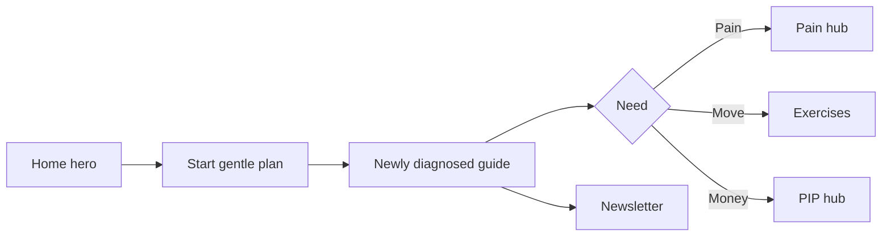

# 03 — Homepage redesign specification

**Goal:** Make four jobs obvious within one screen: newly diagnosed orientation, joint/condition help, self-management tools, and support the charity — without inventing social proof stats.

**Constraint:** Keep educational-not-diagnostic tone. Charity number 1218461 visible in footer. No Oswestry address. Research meter only if figures remain accurate (£5k / £50k until updated from real data).

---

## Section-by-section spec

| # | Section | Purpose | Content rules | Primary CTA |
|---|---|---|---|---|
| 0 | Skip link + update banner | A11y / honesty | Banner dismissible; not forever | — |
| 1 | Global header | Nav + Donate + Search + Chat | Reduce mega-nav cognitive load | Donate (secondary) |
| 2 | Hero | Empathy + orientation | One H1; two CTAs max | **Start your gentle plan** → newly diagnosed / joint picker |
| 3 | Trust strip | E-E-A-T | Charity no.; HCPC PH128483; “educational not diagnosis”; independence from Arthritis UK | Editorial standards |
| 4 | Find your starting point | Job router | Joint + need chips (already strong) | Dynamic next links |
| 5 | Practical hubs | Depth | Exercise, Diet, Conditions, PIP, Blog — five cards max | Hub links |
| 6 | Tools band | Product | Symptom checker + self-help + chat | Symptom checker |
| 7 | Medication / UK guides | YMYL | Educational; ask rheumatology team | Drug guide |
| 8 | Stories (optional) | Belonging | Only real consented stories; else omit | Stories index |
| 9 | Research fund | Mission | Accurate meter only | Donate to research |
| 10 | Get support | Helpline / Connect / Events | Realistic response times only | Helpline |
| 11 | Newsletter | Capture | Clear privacy; GA4 events | Subscribe |
| 12 | Final donate band | Conversion | One-time / monthly clarity | Donate |
| 13 | Footer | Legal / a11y / sources | Charity Commission link; no registered address on page | — |

**Deprioritise on Home (move deeper):** long Zakat narrative (keep entry point, not full appeal), multi-language experiments, shop, competing “urgent” appeals unless campaign-critical.

---

## ASCII wireframe (desktop)

```
+------------------------------------------------------------------+
| [Skip]  LWA logo    About arthritis  Manage  Support  Resources  |
|                     Research  Get involved     [Search] [Donate] |
+------------------------------------------------------------------+
| HERO                                                             |
| Living With Arthritis UK — evidence-based health guides          |
| Empathy line (1–2 sentences).                                    |
| [ Start your gentle plan ]   [ Donate — keep it free ]           |
| Trust: Charity 1218461 · Reviewed Louis Maxwell HCPC PH128483    |
|        Educational information — not a diagnosis                 |
+------------------------------------------------------------------+
| FIND YOUR STARTING POINT                                         |
| (1) Where does it hurt?  [Knee][Hip][Hands][Back][Neck][All]    |
| (2) What do you need?    [Exercises][Understand][Diet][PIP]...  |
| → Shows 2–3 next pages                                           |
+------------------------------------------------------------------+
| PRACTICAL HUBS (5 cards)                                         |
| Nutrition | Exercise | Conditions | Benefits & PIP | Blog library|
+------------------------------------------------------------------+
| TOOLS: Symptom checker | Self-help | Chat (educational)          |
+------------------------------------------------------------------+
| UK medication guides (3 cards) — no doses                        |
+------------------------------------------------------------------+
| Research fund: £5,000 of £50,000 (only if still accurate)        |
+------------------------------------------------------------------+
| Support: Helpline · Connect · Events · Volunteer                 |
+------------------------------------------------------------------+
| Newsletter                                                       |
+------------------------------------------------------------------+
| Footer: policies · sources · Charity Commission · accessibility  |
+------------------------------------------------------------------+
```

---

## Mermaid user flows

### Newly diagnosed



### Rheumatoid arthritis

```mermaid
flowchart LR
  A[Home / Conditions nav] --> B[/conditions/rheumatoid-arthritis]
  B --> C[RA hub / library]
  C --> D[Drug guide educational]
  C --> E[Fatigue / mental health]
  C --> F[Connect groups]
```

### Donate

```mermaid
flowchart LR
  A[Donate CTA] --> B[/donate]
  B --> C[Amount + Gift Aid]
  C --> D[Stripe checkout]
  D --> E[Success + GA4 donate]
  E --> F[Optional research fund]
```

### Healthcare professional

```mermaid
flowchart LR
  A[Footer / HCP hub NEW] --> B[/healthcare-professionals]
  B --> C[Clinic pack PDF]
  B --> D[Shareable patient pages]
  B --> E[Contact for talks]
```

---

## Acceptance criteria

- [ ] ≤2 primary CTAs in hero  
- [ ] Trust strip above the fold on mobile  
- [ ] Joint picker still works; does not claim diagnosis  
- [ ] No invented testimonials or traffic numbers  
- [ ] Lighthouse / a11y checks on homepage template in CI budget  
- [ ] GA4: `page_view` on `/`, donation clicks instrumented  

*Next: [04-ACCESSIBILITY-WCAG-22-AA.md](./04-ACCESSIBILITY-WCAG-22-AA.md)*
